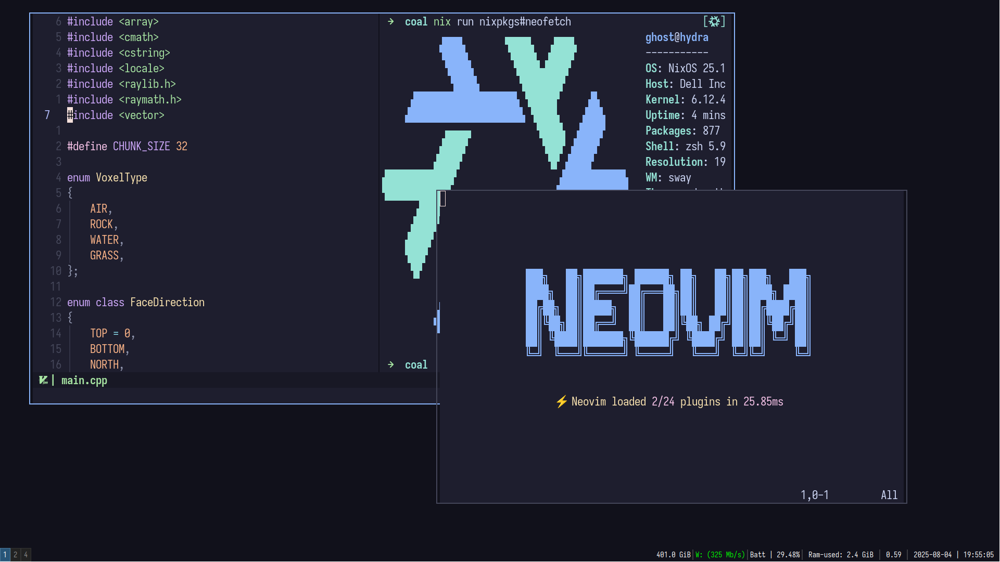

# My NixOS config. 

Designed for very small RAM footprint and speed and zero-bloat. 

## Configurations: 

- Stuff related to NixOS modules lives in [modules/nixos](modules/nixos)
- Stuff related to home-manager modules lives [modules/home](modules/home)
- Custom "ghost" modules live in [modules/ghost](modules/ghost)
- Shell scripts for "ghost" module of shell-scripts [modules/scripts](modules/scripts)
- Wallpapers for stylix NixOS module [modules/wallpapers](modules/wallpapers)

## Info: 

- Stylix - Themeing framework 
- Foot - Terminal 
- Catppuccin (mocha) - Main theme 
- Neovim - Editor 
- zsh - Shell 
- Shell Framework - none (custom prompt written in shell + home-manager managed stuff) 
- Font - IosevkaTerm Nerd Font (pkgs.nerd-fonts.iosevka)
- Rofi - App launcher 
- Sway - Window Manager 
- Autotiling-rs - Tiling manager for sway (master stack layout) 
- Lockscreen - swaylock-effects

(You'll find me refer to myself as "ghost" in a lot of places, that's a nickname of mine) 
